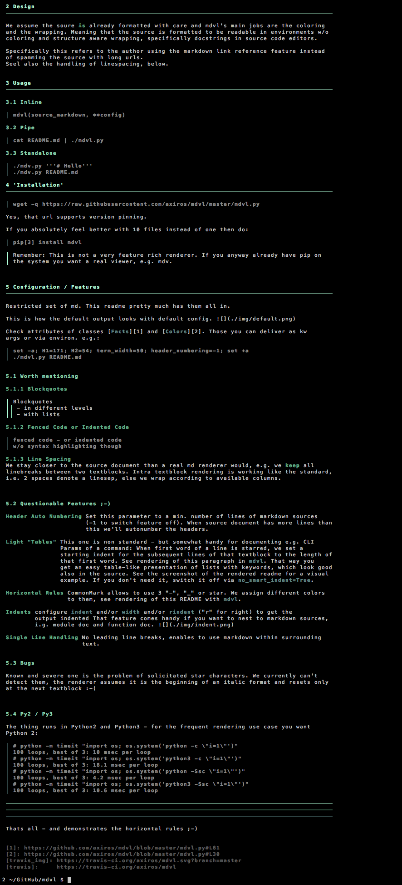

# Light Markdown Renderer

[](https://travis-ci.org/axiros/mdvl)

Dependency free renderer for a subset of markdown to the terminal
- w/o going via HTML (i.e. no html markup support)
- sloc (w/o comments) around 100, i.e. adaptable, extendable

> This one is intended soleley to hilite somewhat "lightly" structured text
reasonably swift. Ideal for highlighting doc strings or CLI command help, where you
don't want to install markdown libs to do that first - e.g. in new containers.

In no way this is useable as a full markdown document viewer, alone for the
missing html support.

A real use case are bash scripts, where you repeatedly want to output formatted stuff, e.g. in a loop.
Then, a very lightweight tool (short startup time for the python process)
is desirable.
Note: There [are](https://github.com/chadbraunduin/markdown.bash)
 unix standard tool based renderers around, with good results, check them out
 (and if only to see how awesome `sed` really is...).
They did not work for me for some output related problems - but they might for you.

Originally the script was within a Here Document within bash scripts but this
version would be also useable inline in a python programs. Thats why some
overhead for config mgmt is present - for a version embedded in e.g. a bash
script you would only need the main function and replace the `C.<color>` with
the shell eviron vars, e.g. `C.H1` -> `$H1`


# Design

## Wrapping
We stay closer to the source document than a real md renderer would, e.g. we
keep all linebreaks between two textblocks.
Intra textblock rendering is working like the standard, i.e. 2 spaces denote a linesep, else we wrap according to available columns.


# Usage

## Inline

    mdvl(source_markdown, **config)

## Pipe

    cat README.md | ./mdvl.py

## Standalone

```
./mdv.py '''# Hello'''
./mdv.py README.md
```

# 'Installation'

    wget -q https://raw.githubusercontent.com/axiros/mdvl/master/mdvl.py

The url supports version pinning.

If you absolutely feel better with 10 files instead of one then do:

    pip[3] install mdvl

> But if you already have pip on the system you anyway want a real renderer, e.g. mdv.


# Configuration / Features

Restricted set of md. This readme pretty much has them all in.

This is how the default output looks with default config.


Check attributes of classes [`Facts`][1] and [`Colors`][2].
Those you can deliver as kw args or via environ. e.g.:

```
set -a; H1=171; H2=54; term_width=50; header_numbering=-1; set +a
./mdvl.py README.md
```


Additionally worth mentioning

> Blockquotes
>> - in different levels
>> - with lists

    fenced code - or indented code
    w/o syntax highlighting though


## Questionable Features ;-)

*Header Auto Numbering* Set this parameter to a min. number of lines of
markdown sources (-1 to switch feature off). When source document has more
lines than this we'll autonumber the headers.

*Light "Tables"* This one is non standard - but somewhat handy for documenting e.g.
CLI Params of a command:
When first word of a line is starred, we set a starting indent for the
subsequent lines of that textblock to the length of that first word.
See rendering of this paragraph in `mdvl`.
That way you get an easy table-like presentation of lists with keywords,
which look good also in the source. See the screenshot of the rendered readme for a visual example.
If you don't need it, switch it off via `no_smart_indent=True`.

*Horizontal Rules* CommonMark allows to use 3 "-", "_" or star. We assign
different colors to them, see rendering of this README with `mdvl`.

*Indents* configure `indent` and/or `width` and/or `rindent` ("r" for right) to get the output indented
That feature comes handy if you want to nest to markdown sources, i.g. module
doc and function doc. 

*Single Line Handling* No leading line breaks, enables to use markdown within
 surrounding text.


## Bugs

Known and severe one is the problem of solicitated star characters. We
currently can't detect them, the renderer assumes it is the beginning of an
italic format and resets only at the next textblock :-(


## Py2 / Py3

The thing runs in Python2 and Python3 - for the frequent rendering use case you
want Python 2:

```
# python -m timeit "import os; os.system('python -c \"i=1\"')"
100 loops, best of 3: 10 msec per loop
# python -m timeit "import os; os.system('python3 -c \"i=1\"')"
100 loops, best of 3: 18.1 msec per loop
# python -m timeit "import os; os.system('python -Ssc \"i=1\"')"
100 loops, best of 3: 4.2 msec per loop
# python -m timeit "import os; os.system('python3 -Ssc \"i=1\"')"
100 loops, best of 3: 10.6 msec per loop
```

****
____
----

Thats all - and demonstrates the horizontal rules ;-)


[1]: https://github.com/axiros/mdvl/blob/master/mdvl.py#L61  
[2]: https://github.com/axiros/mdvl/blob/master/mdvl.py#L30
